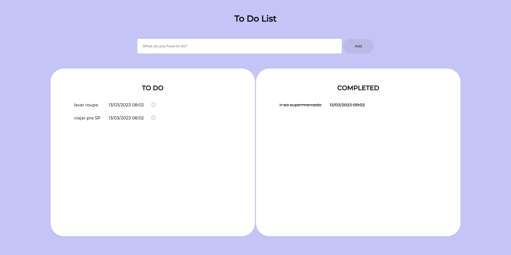

# To-Do-List
Projeto pro curso técnico de DS no SENAI.

## Para Executar
- Clone o projeto no seu desktop/notebook;
- Abre o XAMPP Control Panel e da start em MySQL e em Apache;
- Copia e cola o script no diretório "/docs/todo.sql" no MariaDB ou PHPMyAdmin;
- Abre o VSCode;
- Aperta as teclas `CTRL + '` para abrir linha de comando;
- Acessa a pasta "/back" digitando:
    - cd back
- Baixa as dependências digitando:
    - npm i
- Execute digitando:
    - nodemon (para atualizações em tempo real)
- Acessa o arquivo "index.html" na pasta "/front" com a extensão do VSCode, Live Server

## Tela

## DER

## Diagrama de Classes

## Casos de Uso
